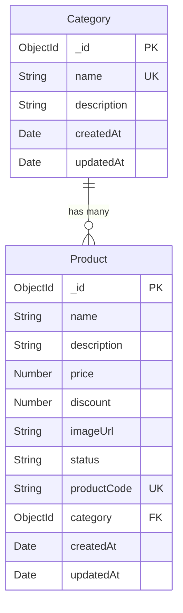

# 6sense Backend Development Challenge

A Node.js/Express.js backend API for product management with MongoDB integration.

## 🚀 Features

- **Product Management**: Create, read, update products with auto-generated product codes
- **Category Management**: Create and manage product categories
- **Smart Product Code Generation**: Auto-generates unique product codes based on product names
- **Advanced Filtering**: Filter products by category and search by name
- **Price Calculation**: Automatic final price calculation with discount
- **Validation**: Comprehensive input validation using Zod
- **Error Handling**: Global error handling middleware

## 🛠️ Tech Stack

- **Runtime**: Node.js
- **Framework**: Express.js
- **Language**: TypeScript
- **Database**: MongoDB with Mongoose ODM
- **Validation**: Zod
- **Development**: ts-node-dev for hot reloading

## 📋 Requirements Implementation Status

### ✅ Completed Features

1. **✅ Create Product**: Full implementation with all required fields
2. **✅ Product Code Generation**: Smart algorithm with hash prefix
3. **✅ Category Association**: Products linked to valid categories
4. **✅ Update Product**: Update status, description, and discount
5. **✅ Product Filtering**: Filter by category and search by name
6. **✅ Price Calculation**: Original and final price after discount

### 🔧 Product Code Generation Algorithm

The product code generation follows these steps:

1. **Extract longest increasing substrings** from product name (consecutive letters in alphabetical order)
2. **Concatenate multiple substrings** if they have equal length
3. **Add indices** (start and end positions)
4. **Prefix with hash** of product name
5. **Format**: `<hash>-<start_index><substring><end_index>`

**Example**: "Alpha Sorter" → "hash-0alport8"

## 🗄️ Database Schema



### Data Models

#### Category Model

```typescript
{
  name: String (required, unique),
  description: String (optional),
  timestamps: true
}
```

#### Product Model

```typescript
{
  name: String (required),
  description: String (required),
  price: Number (required, positive),
  discount: Number (0-100%),
  imageUrl: String (required, valid URL),
  status: String (enum: "In Stock" | "Stock Out"),
  productCode: String (required, unique, auto-generated),
  category: ObjectId (required, ref: "Category"),
  timestamps: true
}
```

## 🚀 Getting Started

### Prerequisites

- Node.js (v14 or higher)
- MongoDB (local or cloud instance)
- npm or yarn

### Installation

1. **Clone the repository**

   ```bash
   git clone https://github.com/alaminhossa1n/6sense-backend-task
   cd 6sense-task
   ```

2. **Install dependencies**

   ```bash
   npm install
   ```

3. **Environment Setup**

   ```bash
   cp env.example .env
   ```

   Edit `.env` file with your configuration:

   ```env
   MONGO_URI=mongodb://localhost:27017/6sense-task
   PORT=5000
   NODE_ENV=development
   ```

4. **Start Development Server**

   ```bash
   npm run dev
   ```

5. **Build for Production**
   ```bash
   npm run build
   npm start
   ```

## 📡 API Endpoints

### Categories

| Method | Endpoint                  | Description           |
| ------ | ------------------------- | --------------------- |
| POST   | `/api/v1/category/create` | Create a new category |
| GET    | `/api/v1/category`        | Get all categories    |

### Products

| Method | Endpoint                     | Description               |
| ------ | ---------------------------- | ------------------------- |
| POST   | `/api/v1/product/create`     | Create a new product      |
| GET    | `/api/v1/product`            | Get products with filters |
| PATCH  | `/api/v1/product/update/:id` | Update product details    |

### Query Parameters for Product Filtering

- `categoryId`: Filter by category ID
- `searchKey`: Search products by name (partial match)

## 📝 API Examples

### Create Category

```bash
POST /api/v1/category/create
Content-Type: application/json

{
  "name": "Electronics",
  "description": "Electronic devices and gadgets"
}
```

### Create Product

```bash
POST /api/v1/product/create
Content-Type: application/json

{
  "name": "Alpha Sorter",
  "description": "A high-quality sorting device",
  "price": 299.99,
  "discount": 15,
  "imageUrl": "https://example.com/image.jpg",
  "status": "In Stock",
  "category": "category_id_here"
}
```

### Get Products with Filters

```bash
GET /api/v1/product?categoryId=category_id&searchKey=alpha
```

### Update Product

```bash
PATCH /api/v1/product/update/product_id
Content-Type: application/json

{
  "status": "Stock Out",
  "discount": 20,
  "description": "Updated description"
}
```

## 🔍 Response Format

All API responses follow this structure:

```json
{
  "success": true,
  "message": "Operation message",
  "data": {
    // Response data
  }
}
```

### Product Response with Price Calculation

```json
{
  "success": true,
  "message": "Products Retrieved Successfully",
  "data": [
    {
      "_id": "product_id",
      "name": "Alpha Sorter",
      "description": "A high-quality sorting device",
      "price": 299.99,
      "discount": 15,
      "finalPrice": 254.99,
      "imageUrl": "https://example.com/image.jpg",
      "status": "In Stock",
      "productCode": "hash-0alport8",
      "category": {
        "_id": "category_id",
        "name": "Electronics"
      }
    }
  ]
}
```

## 🛡️ Validation Rules

### Product Validation

- **Name**: 2-100 characters
- **Description**: 10-1000 characters
- **Price**: Positive number
- **Discount**: 0-100%
- **Image URL**: Valid URL format
- **Status**: "In Stock" or "Stock Out"
- **Category**: Valid category ID

### Category Validation

- **Name**: 2-100 characters, unique
- **Description**: Max 500 characters (optional)

## 🚨 Error Handling

The API includes comprehensive error handling:

- **400**: Bad Request (validation errors)
- **404**: Not Found (resource not found)
- **500**: Internal Server Error

Error response format:

```json
{
  "success": false,
  "message": "Error message",
  "error": {
    "code": 400,
    "description": "Detailed error description"
  }
}
```
## 📁 Project Structure

```
src/
├── app/
│   ├── config/
│   ├── errors/
│   │   └── AppError.ts
│   ├── middlewares/
│   │   └── globalErrorHandler.ts
│   ├── modules/
│   │   ├── Category/
│   │   │   ├── category.controller.ts
│   │   │   ├── category.model.ts
│   │   │   ├── category.routes.ts
│   │   │   ├── category.service.ts
│   │   │   └── category.validation.ts
│   │   └── Product/
│   │       ├── product.controller.ts
│   │       ├── product.model.ts
│   │       ├── product.routes.ts
│   │       ├── product.service.ts
│   │       └── product.validation.ts
│   └── utils/
│       ├── codeGenerator.ts
│       └── hash.ts
├── app.ts
└── server.ts
```
